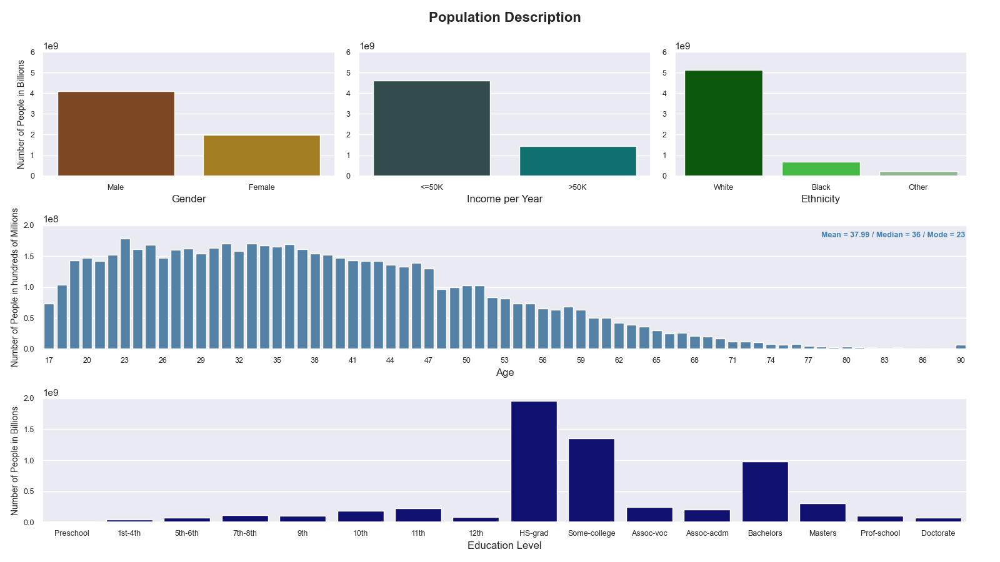
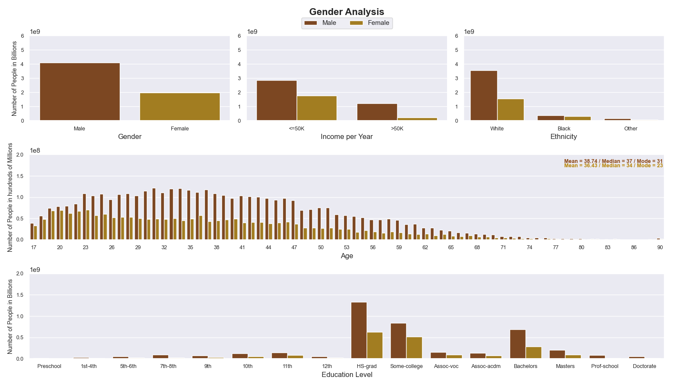
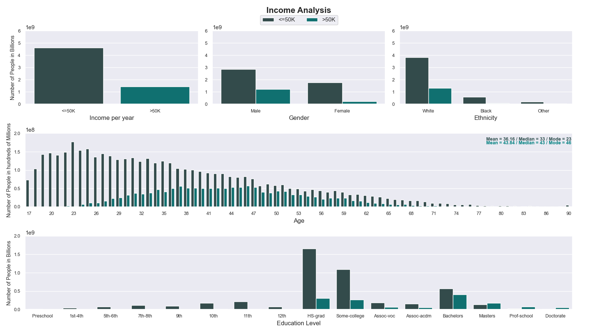
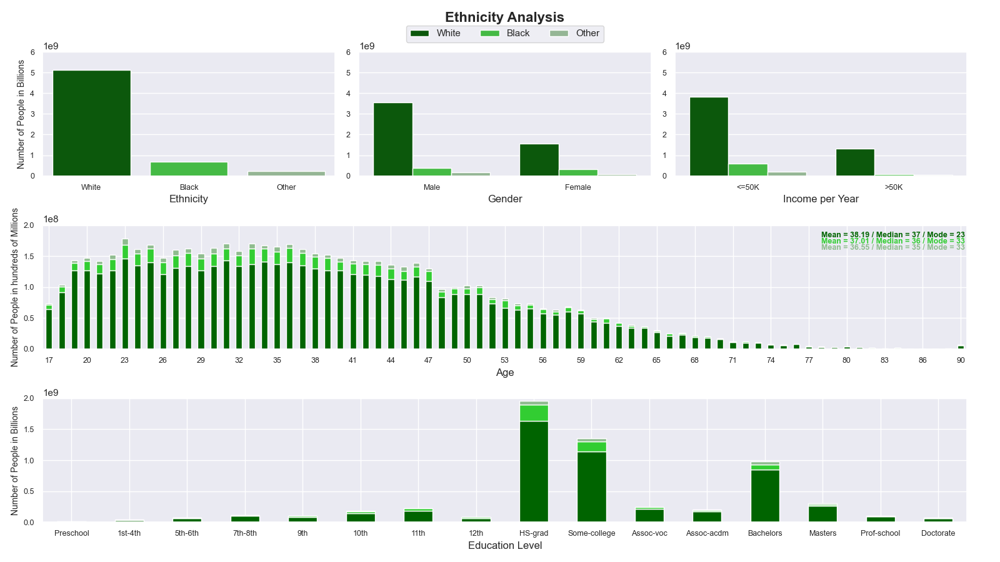

# Improved Data Visualization - Census 1994

An App created within the "Exploratory Data Analysis and Visualization" module by IU - International University.

## What is it?

This app aims to provide an enhanced visualization of the 1994 census data.
Font: https://www.kaggle.com/datasets/anaghakp/adult-income-census/data

## Installation

```shell
pip install -r requirements.txt
```
Run the above command to install all the required libraries.

## Usage

```shell
python main.py
```

Run the above command to star the app and follow the instructions on screen. 
To navigate on the App, use the arrow keys on your keyboard.





